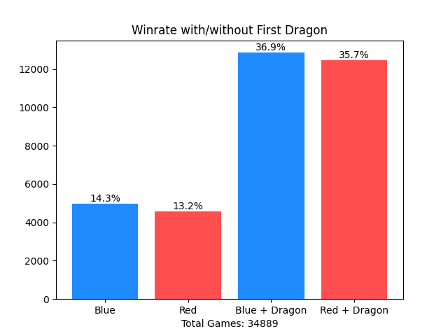
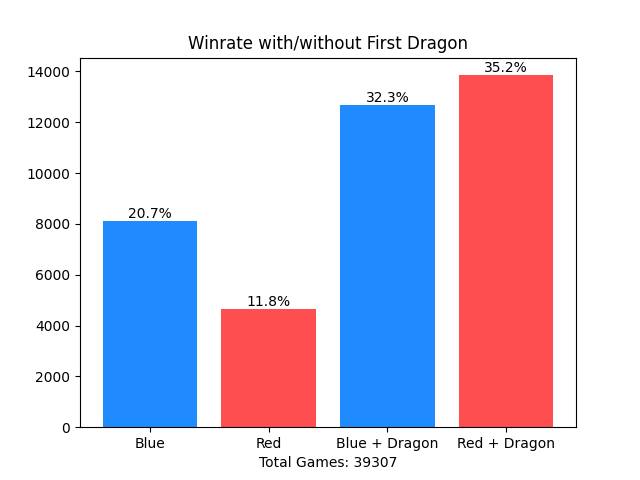

## League of Legends Data Analysis

### The Question: 
- How will a player's winrate be effected by claiming the first dragon in the game?

### Hypothesis: 
- I estimate on average, the team that claims the dragon first will have a 5-10% higher probable winrate than
the teams that do not.

### Equipment:
- I will use CSV ranked data of 50,000 League of Legends games from "https://www.kaggle.com/datasets/datasnaek/league-of-legends?resource=download", (Mitchell. J, 2017).
- The Pandas library will be used with Python to conduct any Data Analysis.
- Matplotlib to create graphs of the Data.

### Method: 
- The data will be cleaned of all anomalies, anomalies are defined by games that end before an objective is claimed,
data that is corrupted/N/A etc.
- To make sure there is as little statistical bias as possible, I will remove Data where the Games last longer than 35 minutes,
this is because at 35 minutes, the Baron and Elder dragon objective teams can claim will drastically affect the Data, such games should be
treated as anomalies.
- The data will be plot onto a bar chart to easily compare the win percentage of games when either team acquires, or does not acquire
the first dragon of the game.

### Conclusion:

After processing and analysing the data, the results show that my hypothesis was not only correct, but it surpasses my estimations
completely, both teams gained a massive 22%~ increase in winrate. This means that getting the first dragon could be one of the biggest
factors in deciding which team will win the game.

Such a large increase would suggest that it is not mere correlation that acquiring the first dragon will lead to a better
likelyhood of winning the game. However, one must consider that the cause and effect of a team taking the dragon
would imply they are already in a position to take it in the first place.

AKA, "A team that is more likely to win the game is also more likely to slay the dragon to begin with."

One way to check this new hypothesis is to filter out the games where the first dragon has been slain with a sizeable "gold lead".
In layman's terms, "gold" in this game equates very strongly to which team is in a "winning position". Therefore, one can remove the games
where there is a large gap between both team's total gold. 
This means, whichever team got the Dragon did so on equal footing, and thus acquiring it was not correlated to that team
already being in a more favourable circumstance.
Unfortunately, the dataset which I have access to does not have this kind of data. So I will not be able to do such analysis.

An interesting case this analysis suggested was that the Blue team, for some unknown reason has a small 
chance of winning a game over the red team. Both with/without the first Dragon,
Blue team's winrate is close to 1%~ greater than red team.

This is an alarmingly high difference, out of 34889 games, Blue team has a 51.2% winrate, and Red team has a 48.9% winrate
The standard error for 34889 games:
S.E = sqrt(0.512 * 0.489) / 34889 = 0.0027 (0.27%)
Margin of error at 95% is 1.96 * 0.27% which is approximately 0.53%
Which means:
Blue winrate is 51.2% ± 0.53%
Red winrate is 48.9% ± 0.53%
The difference is 2.3% between them, 2.3% / 0.53% gives us how many standard deviations they are apart.
2.3 / 0.53 = 4 standard deviations!!!

This analysis proves beyond reasonable doubt that the Blue Team has a much higher probability of winning, regardless of gamestate.
If you're on red side, getting the first dragon is the difference between being at a statistical loss and an outright win.

# Updated Analysis
The data I used previously was curated in 2017, 9 years ago. I have stumbled across fresh data from patch 25+, which is close to within 7 months ago from this source:
"https://www.kaggle.com/datasets/californianbill/patch-25-14-lol-league-of-legends-ranked-games", (CalifornianBill, 2025).
To see how much the game has changed since then I re-ran the analysis, modifying to accomodate the new data I have access to.

### Core Changes
- This new dataset has team0BaronKills, team1BaronKills as well as team0DragonFirst and team1DragonFirst
- This means that I can now filter out games where total baron kills = 0 rather than only culling the games that were shorter than 2100 seconds. This increases the validity of the data tenfold
- It also means I can remove any games where neither team got a dragon

### New Conclusion

The new data emphasises that the first dragon objective is still a huge factor. But what is even more interesting is that the game has shifted, oddly, Blue team has a landslide of a higher probability of winning the game than red team without a dragon, but with the first dragon red team actually beats blue team by a sizeable margin. This means that this season, more than the season 9 years ago red team must prioritise the first dragon more than ever.
- Blue team has a even higher total winrate over red team this season, the previous 2.3% difference in average 9 years ago has become a wopping 53% - 47% = 6%!!!
- Using the same standard deviation process as before using a margin of error of 95%, we can calculate that at 6% divided by a standard deviation of 0.494% (1.96 * sqrt(0.53 * 0.47 / 39307), blue teams winrate is over 12 standard deviations!
- This means Blue team absolutely has an innate advantage of some kind that leads to winning more games
